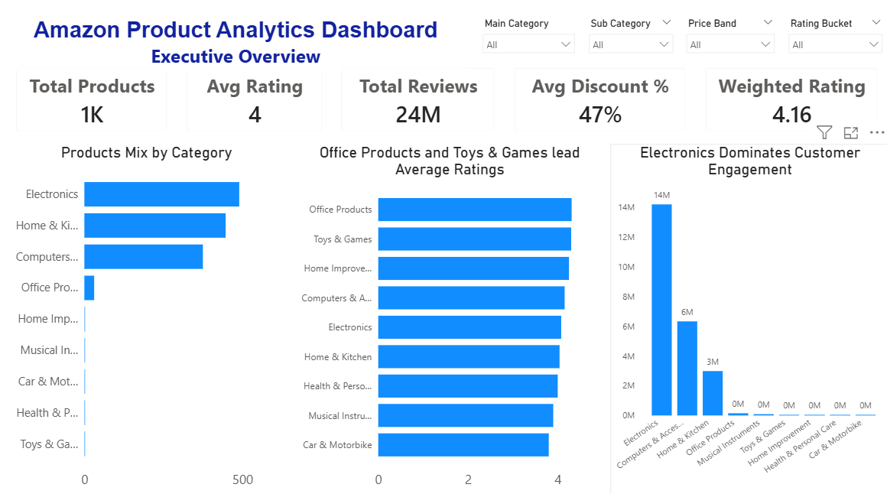
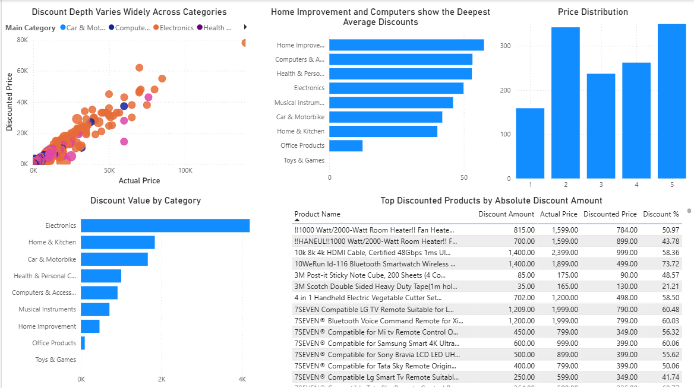
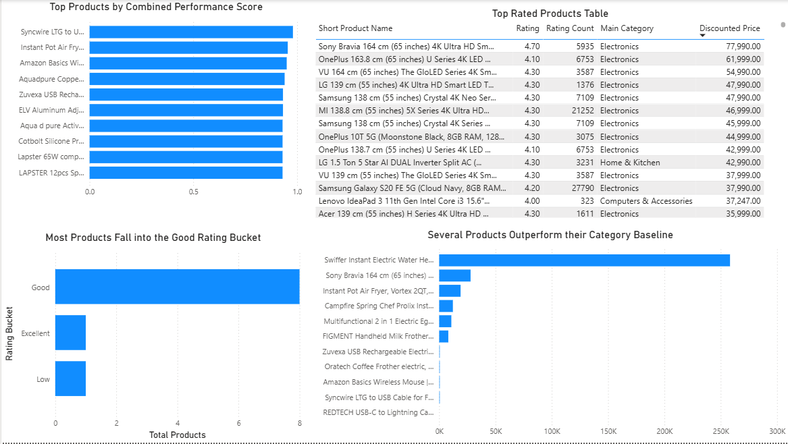

# Amazon Product Analytics: Pricing, Discounts, Ratings & Customer Engagement

## 🧠 Executive Takeaway

Analysis shows that **customer engagement is highly concentrated in a few categories, particularly Electronics**, which generates the majority of product reviews.

Despite widespread discounting, **higher discounts do not consistently improve ratings or engagement**, indicating that pricing alone is not a reliable driver of performance.

The results suggest that **targeted promotions and category-specific strategies are more effective than broad discounting approaches**, with product quality and demand playing a more significant role.

---

## 📌 Overview

This project is an end-to-end data analytics case study focused on analyzing Amazon product listings to understand how pricing, discount strategies, and customer feedback influence product performance and engagement.

Using Python for data cleaning, SQL for analysis, and Power BI for visualization, the project transforms raw product data into actionable business insights that can support pricing, merchandising, and promotional decisions.

---

## 🎯 Business Problem

Amazon offers a wide range of products across multiple categories, each with different pricing structures, discount strategies, and customer engagement levels.

However, key questions remain:

* Do higher discounts lead to better product performance?
* Which categories generate the most customer engagement?
* Are discounts being used efficiently across categories?
* Which products outperform their category averages?

This project aims to answer these questions using data-driven analysis.

---

## 🎯 Objectives

* Analyze pricing and discount patterns across product categories
* Evaluate the relationship between discounts, ratings, and engagement
* Identify high-performing products and categories
* Detect inefficiencies in discount strategies
* Provide actionable business recommendations

---

## 📊 Dataset

The dataset consists of Amazon product listings with the following key fields:

* Product Name
* Category (Main & Sub Category)
* Actual Price
* Discounted Price
* Discount Percentage
* Rating
* Rating Count (Customer Reviews)

---

## 🛠️ Tools & Technologies

* **Python (Pandas, NumPy)** → Data cleaning & preprocessing
* **SQL** → Data Querying and Analysis
* **Power BI** → Dashboard Development & Data Visualization
* **DAX** → Custom measures and KPIs
* **GitHub** → Version control and project documentation

---

## 🔄 Project Workflow

1. Data Collection
2. Data Cleaning (Python)

   * Removed missing and inconsistent values
   * Converted price fields to numeric format
   * Standardized categories
3. Feature Engineering

   * Discount Amount
   * Price Bands
   * Rating Buckets
   * Weighted Rating
4. SQL Analysis

   * Aggregations and category-level insights
   * Identification of high-performing products
5. Dashboard Development (Power BI)
6. Insight Generation & Business Recommendations

---

## 📈 Dashboard Overview

### Executive Overview



* Total Products, Average Rating, Total Reviews
* Category distribution
* Customer engagement by category

---

### Pricing & Discount Analysis



* Relationship between actual price and discounted price
* Discount trends across categories
* Top discounted products

---

### Product Performance



* Top products by performance score
* Rating distribution
* Products outperforming category averages

---

## 🔍 Key Insights

* **Electronics dominates customer engagement**, contributing the highest number of reviews across all categories.
* **Higher discounts do not consistently lead to better ratings or engagement**, indicating that discounting alone does not improve perceived product quality.
* **Customer engagement is concentrated among a small number of products**, suggesting a long-tail distribution.
* **Pricing and discount behavior varies significantly across categories, indicating that a one-size-fits-all discount strategy is ineffective.**
* **Weighted ratings provide a more reliable performance metric** than simple averages.

---

## 💡 Business Recommendations

* **Prioritize high-engagement categories**
  Focus promotional and marketing efforts on categories such as Electronics, where customer activity and review volume are highest.

* **Optimize discount strategy by category**
  Avoid applying uniform discounting across all categories. Instead, tailor discount levels based on category performance and engagement patterns.

* **Reduce inefficient discounting**
  Identify products and categories with high discount percentages but low engagement or ratings, and reassess pricing strategies to protect margins.

* **Promote high-performing products**
  Use a combination of weighted rating and review volume to identify “hero products” that can be prioritized for campaigns and visibility.

* **Adopt performance-based product ranking**
  Move beyond average rating by incorporating engagement metrics (e.g., review count, weighted rating) for more reliable product evaluation.

---

## 🧮 SQL Analysis Highlights

SQL was used to explore category-level performance, pricing behavior, and product-level insights.

### Category Performance

```sql
SELECT main_category,
       AVG(rating) AS avg_rating,
       SUM(rating_count) AS total_reviews
FROM products
GROUP BY main_category;
```

➡️ Identified Electronics as the highest engagement category.

---

### Discount Efficiency

```sql
SELECT product_name,
       discount_percentage,
       rating
FROM products
WHERE discount_percentage > 50
AND rating < 3.5;
```

➡️ Highlighted products with high discounts but weak performance.

---

### High-Performing Products

```sql
SELECT product_name,
       rating,
       rating_count
FROM products
WHERE rating >= 4.0
AND rating_count > 5000
ORDER BY rating_count DESC;
```

➡️ Identified top-performing products based on rating and engagement.

---

## ⚠️ Limitations

* Review count is used as a proxy for customer engagement and does not directly measure sales or revenue
* The dataset represents a snapshot and does not capture time-based trends
* Ratings may be biased due to uneven customer participation across categories

---

## 📚 Data Dictionary

| Column              | Description             |
| ------------------- | ----------------------- |
| actual_price        | Original product price  |
| discounted_price    | Price after discount    |
| discount_percentage | Percentage reduction    |
| rating              | Average customer rating |
| rating_count        | Number of reviews       |
| main_category       | Product category        |
| sub_category        | Product subcategory     |

---

## 🚀 Future Improvements

* Add time-series analysis for trend detection
* Build a recommendation system for similar products
* Incorporate sales or revenue data for deeper analysis
* Perform A/B testing on discount strategies

---

## 🧠 Key Skills Demonstrated

* Data Cleaning & Preprocessing
* Exploratory Data Analysis (EDA)
* SQL Querying & Aggregation
* Data Visualization (Power BI)
* Business Insight Generation
* Analytical Thinking

---

## 📎 Project Files

* Power BI Dashboard (.pbix)
* Python Notebook (Data Cleaning)
* SQL Queries (Analysis)
* Dataset (CSV)

---

## 📊 Live Dashboard

You can download and explore the interactive dashboard here:
[Download Power BI File](powerbi/amazon_product_analytics.pbix)
